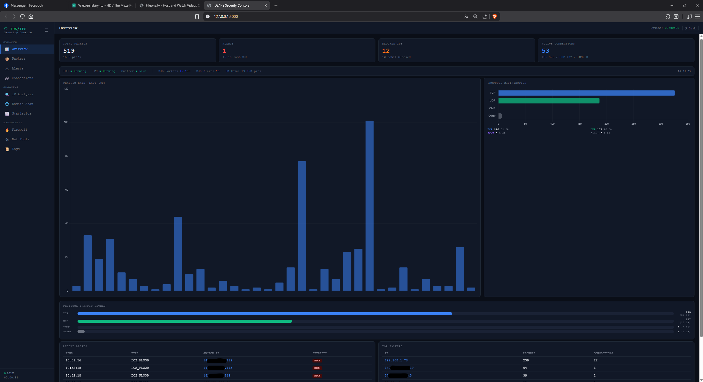

# Python IDS/IPS SIEM – Real-Time Network Security Console



Profesjonalny system wykrywania i zapobiegania włamaniom (IDS/IPS) z zaawansowaną konsolą webową SIEM. Napisany w Pythonie, działający na systemach Windows, Linux i macOS.

---

## Spis treści

1. [Wymagania](#wymagania)
2. [Instalacja](#instalacja)
3. [Uruchomienie](#uruchomienie)
4. [Struktura projektu](#struktura-projektu)
5. [Konfiguracja](#konfiguracja)
6. [Funkcje systemu](#funkcje-systemu)
7. [Opis zakładek dashboardu](#opis-zakładek-dashboardu)
8. [API REST](#api-rest)
9. [Silnik reguł IDS](#silnik-reguł-ids)
10. [Baza danych SQLite](#baza-danych-sqlite)
11. [Tryb zdegradowany](#tryb-zdegradowany)
12. [Uruchamianie testów](#uruchamianie-testów)
13. [Bezpieczeństwo](#bezpieczeństwo)

---

## Wymagania

- Python 3.10+
- System operacyjny: Windows 10/11, Linux (Debian/Ubuntu/Arch), macOS 12+
- Uprawnienia administratora / root (wymagane do przechwytywania pakietów)
- Npcap (Windows) lub libpcap (Linux/macOS)

---

## Instalacja

```bash
# 1. Sklonuj repozytorium
git clone https://github.com/YOUR_USERNAME/python-ids-ips-siem.git ids-ips
cd ids-ips/ids_ips_system

# 2. Utwórz środowisko wirtualne
python -m venv .venv

# Windows
.venv\Scripts\activate

# Linux / macOS
source .venv/bin/activate

# 3. Zainstaluj zależności (runtime + dev)
pip install -r requirements.txt
```

### Windows – wymagany Npcap

Pobierz i zainstaluj [Npcap](https://npcap.com/#download) przed uruchomieniem. Zaznacz opcję **"Install Npcap in WinPcap API-compatible Mode"**.

---

## Uruchomienie

```bash
# Windows (PowerShell jako Administrator)
python main.py

# Linux / macOS
sudo python main.py
```

Po uruchomieniu dashboard dostępny jest pod adresem: **http://127.0.0.1:5000**

---

## Struktura projektu

```
ids_ips_system/
├── main.py                    # Punkt wejścia aplikacji
├── requirements.txt           # Zależności (runtime + pytest)
├── config/
│   └── config.yaml            # Konfiguracja systemu
├── core/
│   ├── ids.py                 # Silnik IDS – worker thread
│   ├── ips.py                 # Silnik IPS – blokowanie IP
│   ├── rules.py               # Silnik reguł (6 typów detekcji)
│   ├── connection_tracker.py  # Śledzenie aktywnych połączeń
│   └── traffic_series.py      # Dane czasowe ruchu (sparkline)
├── sniffer/
│   └── packet_sniffer.py      # Przechwytywanie pakietów (Scapy)
├── db/
│   └── database.py            # SQLite – singleton WAL, 8 tabel
├── utils/
│   ├── config_loader.py       # Ładowanie i walidacja config.yaml
│   ├── logger.py              # Logger z poziomami ALERT i BLOCKED + routing Werkzeug do pliku
│   ├── platform_utils.py      # Blokowanie IP (netsh/iptables/pfctl)
│   ├── dns_resolver.py        # Asynchroniczny resolver DNS z cache
│   ├── geo_lookup.py          # Geolokalizacja IP (ip-api.com)
│   ├── service_detector.py    # Mapowanie portów na nazwy usług
│   ├── net_tools.py           # Ping, traceroute, nslookup, whois, port scan
│   └── scanner.py             # Skaner WWW: TLS, nagłówki, tech detection, crawl, scrape
├── web/
│   ├── app.py                 # Flask API – 36+ endpoints
│   └── templates/
│       └── dashboard.html     # Konsola webowa (10 zakładek)
├── logs/
│   └── system.log             # Logi systemu
├── data/
│   └── ids.db                 # Baza SQLite (tworzona automatycznie)
└── tests/
    ├── conftest.py
    └── test_rules.py          # 11 testów jednostkowych
```

---

## Konfiguracja

Plik `config/config.yaml`:

```yaml
# Interfejs sieciowy: "auto" (domyślny) lub np. "eth0", "Wi-Fi"
interface: auto

# Progi detekcji (pakiety / okno czasowe)
dos_threshold: 100          # DoS flood: max pakietów na IP w oknie
portscan_threshold: 20      # Skanowanie portów: unikalnych portów w oknie
syn_flood_threshold: 80     # SYN flood: pakietów SYN bez ACK
icmp_flood_threshold: 50    # ICMP flood: pakietów ICMP w oknie
time_window: 10             # Okno czasowe w sekundach (1–3600)

# Listy
blacklist:
  - 10.0.0.1                # Zablokowane IP (stała lista w configu)
suspicious_ports:
  - 4444                    # Metasploit
  - 5555
  - 6666
  - 31337                   # Elite / Back Orifice
  - 12345

# IPS (automatyczne blokowanie)
ips_enabled: true
block_timeout: 600          # Czas blokady w sekundach (0 = permanentnie)

# Serwer webowy
web_host: 127.0.0.1
web_port: 5000

# Logowanie
log_file: logs/system.log
log_level: INFO             # DEBUG, INFO, WARNING, ERROR

# Bufor pakietów w pamięci
packet_buffer_size: 1000
```

---

## Funkcje systemu

### Detekcja zagrożeń (IDS)

| Reguła | Typ | Severity | Opis |
|--------|-----|----------|------|
| BLACKLIST | Wykrywanie | HIGH | Pakiet z IP na czarnej liście |
| DOS_FLOOD | Flood | HIGH | Zbyt wiele pakietów od jednego IP w oknie czasowym |
| PORT_SCAN | Rekon | MEDIUM | Zbyt wiele unikalnych portów od jednego IP |
| SYN_FLOOD | Flood | HIGH | Zbyt wiele pakietów SYN bez ACK |
| ICMP_FLOOD | Flood | MEDIUM | Zbyt wiele pakietów ICMP |
| SUSPICIOUS_PORT | Podejrzany port | LOW | Połączenie do portu z listy podejrzanych |

Wszystkie reguły używają prawdziwego okna kroczącego (sliding window), nie bucket-based. Alerty dla tej samej pary (IP, typ) są ograniczone do 1 co 30 sekund (rate limiting).

### Zapobieganie włamaniom (IPS)

- Automatyczne blokowanie IP przy alertach HIGH i MEDIUM
- Sprawdzanie whitelist przed każdym blokowaniem
- Automatyczne odblokowanie po upływie `block_timeout` sekund
- Blokowanie ręczne z poziomu dashboardu
- Wsparcie dla netsh (Windows), iptables (Linux), pfctl (macOS)
- Zapis historii blokad do bazy SQLite

### Analiza sieci

- **Geolokalizacja IP**: kraj, miasto, ISP, ASN (via ip-api.com, 45 req/min)
- **Reverse DNS**: asynchroniczne rozwiązywanie z cache LRU (2000 wpisów, TTL 1h)
- **Historia IP**: wszystkie pakiety, alerty, blokady z bazy danych
- **Śledzenie połączeń**: aktywne połączenia z czasem trwania, pakietami, bajtami, stanem (ACTIVE/IDLE)

### Skaner stron (Domain Scanner)

- Analiza 8 nagłówków bezpieczeństwa HTTP (HSTS, CSP, X-Frame-Options, X-Content-Type-Options, Referrer-Policy, Permissions-Policy, X-XSS-Protection, COOP)
- Inspekcja certyfikatu TLS (wersja, CN, wystawca, ważność, szyfr)
- Ocena ryzyka (risk_score: 0–100, punkty za brakujące nagłówki i HTTP)
- Detekcja stosu technologicznego (React, Vue, Angular, WordPress, Nginx, PHP, ASP.NET i 20+ innych)
- Anonimowy crawler z fałszywym User-Agent (do 20 podstron)
- Scraper: zapis HTML strony + manifest.json (linki, obrazy, skrypty, arkusze CSS) na dysk; opcjonalnie pobiera assety (CSS/JS/obrazy)
- Ekstrakcja linków z HTML
- Pobieranie i wyświetlanie robots.txt
- Historia skanów w bazie SQLite

### Narzędzia sieciowe

- **Ping**: wybieralna liczba pakietów (1–10), czytelny output
- **Traceroute**: śledzenie trasy przez węzły sieci
- **DNS Lookup**: wszystkie typy rekordów (A, AAAA, MX, TXT, NS, CNAME, SOA)
- **WHOIS**: socket-based fallback gdy brak systemowego `whois`
- **Port Scanner**: wielowątkowy skaner TCP (do 2000 portów, format `1-1024` lub `80,443,8080`), wykrywa nazwy usług

---

## Opis zakładek dashboardu

> Dashboard posiada przełącznik ciemny/jasny motyw (topbar, wybór zapamiętywany w `localStorage`) oraz zwijany panel boczny (przycisk ☰). Responsywny – działa na ekranach od 600px szerokości.

### 1. Overview

Główny podgląd systemu w czasie rzeczywistym (odświeżanie co 2s):

- **4 karty statystyk** (klikalne → przejście do odpowiedniej zakładki):
  - Total Packets (→ Packets) – z prędkością pkt/s i liczbą 24h
  - Alerts (→ Alerts) – z liczbą alertów w ostatnich 24h
  - Blocked IPs (→ Firewall) – aktywne blokady i suma historyczna
  - Active Connections (→ Connections) – podział TCP/UDP/ICMP
- **Pasek stanu systemu**: IDS / IPS / Sniffer (running/down), pakiety 24h, alerty 24h, rozmiar bazy, znacznik czasu odświeżenia
- **Wykres ruchu live** (bar chart) – ostatnie 60 sekund, tooltip z pkt/s
- **Wykres Protocol Distribution** (poziome słupki) – TCP/UDP/ICMP/Other z liczbami i procentami udziału; mini-tabela poniżej z kolorowymi etykietami
- **Słupki poziomu ruchu** (down-detector style) – procentowy udział każdego protokołu z liczbą pakietów
- **Lista ostatnich alertów** z linkiem do IP Analysis
- **Top talkers** (IP z największym ruchem)

### 2. Packets

Tabela przechwyconych pakietów z filtrowaniem i trybem live:

- Filtrowanie po protokole, IP źródłowym, porcie docelowym
- Tryb live (auto-odświeżanie co 3s) z możliwością pauzy
- Kolumny: czas, źródło, cel, port, protokół, **flagi TCP** (SYN/ACK/FIN/RST/PSH/URG), rozmiar, usługa
- Eksport całej tabeli do CSV (`↓ CSV`)

### 3. Alerts

Tabela alertów bezpieczeństwa:

- Filtrowanie po severity (HIGH/MEDIUM/LOW) i tekście
- Eksport do CSV
- Szybkie blokowanie IP jednym kliknięciem

### 4. Connections

Tabela aktywnych i niedawnych połączeń:

- Stan: ACTIVE / IDLE
- Statystyki: czas trwania, liczba pakietów, bajty
- Wykrywanie nazwy usługi (port → HTTP, HTTPS, SSH, RDP, itp.)
- Szybkie blokowanie IP

### 5. IP Analysis

Dwa widoki w jednej zakładce:

**Widok Live** (domyślny, Wireshark-style):
- Tabela przechwyconych pakietów w czasie rzeczywistym (auto-odświeżanie co 3s, przycisk Pause/Resume)
- Kolumny: Time / Source IP / Hostname / Destination / Port / Proto / TCP Flags (kolorowane: SYN=zielony, RST=czerwony) / Size / Service
- Kliknięcie dowolnego adresu IP przełącza na widok szczegółowy

**Widok szczegółowy IP** (po kliknięciu IP):
- Przycisk **← Back to Live** powrót do tabeli
- Geolokalizacja (kraj, miasto, ISP, ASN, region)
- Reverse DNS / hostname
- Status: czy zablokowany, czy na whitelist
- Historia pakietów i alertów z bazy danych

> Kliknięcie IP z dowolnej innej zakładki (Packets, Alerts, Connections, Overview, Statistics) automatycznie przełącza do IP Analysis i otwiera widok szczegółowy.

### 6. Domain Scanner

Skaner bezpieczeństwa stron www – trzy tryby:

- **Scan** – pełna analiza: nagłówki HTTP, TLS, ocena ryzyka, linki, robots.txt
- **Detect Tech** – detekcja stosu technologicznego (serwer, framework, CMS, CDN, analityki)
- **Crawl** – anonimowy crawler z fałszywym UA, konfigurowalny limit podstron (1–20)
- **Scrape** – pobiera całą stronę (HTML do 5 MB) i zapisuje na dysk w wybranym folderze; wyodrębnia wszystkie linki, obrazy, skrypty, arkusze CSS i zapisuje je w `manifest.json`; opcja "Download assets" pobiera pliki CSS/JS/img do podfolderu `assets/`; podaje statystyki (status, rozmiar, czas, liczba plików)
- Historia skanów w tabeli

### 7. Statistics

Statystyki z bazy danych SQLite:

- Sumy: pakiety, alerty, alerty 24h, zablokowane IP
- Top źródłowe IP i docelowe porty
- Breakdown typów alertów z severity i liczbą
- Wykres słupkowy ruchu (24h, per godzina)

### 8. Firewall

Zarządzanie blokadami:

- Ręczne blokowanie i odblokowanie IP (z powodem)
- Tabela aktywnych blokad z wiekiem i przyciskiem odblokowania
- Zarządzanie whitelist (dodawanie/usuwanie z notatką)
- Zarządzanie czarną listą manualną
- Pełna historia blokad (typ: auto/manual, status: Active/Expired)

### 9. Network Tools

Narzędzia diagnostyczne z czytelnym formatowaniem wyników:

- **Ping** (z wyborem liczby pakietów) – pokazuje surowy output
- **Traceroute** – pokazuje surowy output
- **DNS Lookup** – rekordy pogrupowane po typie (A, AAAA, MX, TXT, NS, CNAME, SOA)
- **WHOIS** – z socket-based fallbackiem
- **Port Scanner** – wyniki: PORT / USŁUGA w formie tabeli ASCII, format `1-1024` lub `80,443,8080`

### 10. Logs

Przeglądarka logów systemowych (plik `logs/system.log`):

- Wybór liczby ostatnich linii (100/200/500)
- Filtrowanie po tekście
- Tryb live (auto-odświeżanie co 3s)
- Pokazuje **wszystko co widzi terminal**: zdarzenia IDS/IPS (ALERT, BLOCKED, INFO) oraz logi HTTP serwera Flask (każdy request `GET /api/... 200`)
- Wpisy oznaczone poziomem: `[INFO]`, `[WARNING]`, `[ALERT]`, `[BLOCKED]`, `[ERROR]`

---

## API REST

Wszystkie endpointy zwracają JSON (oprócz CSV exports).

| Metoda | Ścieżka | Opis |
|--------|---------|------|
| GET | `/api/stats` | Statystyki IDS (pakiety, alerty, protokoły, uptime) |
| GET | `/api/packets` | Ostatnie pakiety z sniffera (in-memory, z hostname) |
| GET | `/api/db/packets` | Pakiety z bazy SQLite (filtr: protocol, src_ip, dst_ip, dst_port, from_ts, to_ts) |
| GET | `/api/alerts` | Alerty (filtr: limit, severity, search, type, from_ts, to_ts) |
| GET | `/api/blocked` | Aktualnie zablokowane IP |
| GET | `/api/health` | Stan komponentów (sniffer, IDS, IPS, degraded) |
| GET | `/api/traffic/series` | Dane sparkline (pakiety/s ostatnie 60s) |
| GET | `/api/connections` | Aktywne połączenia (limit) |
| GET | `/api/connections/top` | Top talkers (limit) |
| GET | `/api/db/stats` | Podsumowanie bazy danych (pakiety, alerty, blokady 24h/total) |
| GET | `/api/db/top_ports` | Top 10 docelowych portów |
| GET | `/api/db/top_sources` | Top 10 źródłowych IP |
| GET | `/api/db/alert_types` | Breakdown typów alertów z severity |
| GET | `/api/db/timeline` | Ruch godzinowy `?hours=24` |
| GET | `/api/ip/analyze?ip=X` | Pełna analiza IP (geo, DNS, historia, status blokady) |
| GET | `/api/ip/history?ip=X` | Historia IP z bazy (pakiety, alerty, blokady) |
| POST | `/api/scan/domain` | Skanowanie domeny `{"url": "..."}` |
| POST | `/api/scan/tech` | Detekcja technologii `{"url": "..."}` |
| POST | `/api/scan/crawl` | Crawler `{"url":"...", "max_pages":8, "fake_ua":true}` |
| POST | `/api/scan/scrape` | Scraper `{"url":"...", "save_dir":"C:\\...", "include_assets":false}` |
| GET | `/api/scan/history` | Historia skanów domen |
| POST | `/api/tools/ping` | Ping `{"host":"...", "count":4}` |
| POST | `/api/tools/traceroute` | Traceroute `{"host":"..."}` |
| POST | `/api/tools/nslookup` | DNS Lookup (wszystkie typy) `{"host":"..."}` |
| POST | `/api/tools/whois` | WHOIS `{"host":"..."}` |
| POST | `/api/tools/portscan` | Port scan `{"host":"...", "ports":"1-1024"}` |
| POST | `/api/firewall/block` | Blokuj IP `{"ip":"...", "reason":"..."}` |
| POST | `/api/firewall/unblock` | Odblokuj IP `{"ip":"..."}` |
| GET | `/api/firewall/blocked_history` | Historia blokad |
| GET | `/api/whitelist` | Lista whitelist |
| POST | `/api/whitelist` | Dodaj do whitelist `{"ip":"...", "note":"..."}` |
| DELETE | `/api/whitelist` | Usuń z whitelist `{"ip":"..."}` |
| GET | `/api/blacklist` | Manualna czarna lista |
| POST | `/api/blacklist` | Dodaj do czarnej listy `{"ip":"...", "note":"..."}` |
| DELETE | `/api/blacklist` | Usuń z czarnej listy `{"ip":"..."}` |
| GET | `/api/logs` | Logi systemowe `?lines=200` |
| GET | `/api/export/alerts.csv` | Eksport alertów jako CSV |
| GET | `/api/export/packets.csv` | Eksport pakietów jako CSV `?limit=5000` |

---

## Silnik reguł IDS

Każdy pakiet przechodzi przez 6 reguł sprawdzanych w jednej blokadzie mutexu:

1. **Blacklist** – natychmiastowa detekcja przy pierwszym pakiecie od zablokowanego IP
2. **DoS Flood** – sliding window: jeśli liczba pakietów od IP w ciągu `time_window` sekund przekroczy `dos_threshold`, generuje alert HIGH
3. **Port Scan** – sliding window: jeśli IP odpytał więcej niż `portscan_threshold` unikalnych portów w oknie, generuje alert MEDIUM
4. **SYN Flood** – flaga SYN bez ACK (`flags & 0x02 and not flags & 0x10`): jeśli count > `syn_flood_threshold`, alert HIGH
5. **ICMP Flood** – analogicznie dla ICMP > `icmp_flood_threshold`, alert MEDIUM
6. **Suspicious Port** – sprawdzenie listy `suspicious_ports`, alert LOW

**Rate limiting**: ten sam (IP, typ alertu) nie generuje kolejnego alertu przez 30 sekund.

**Czyszczenie pamięci**: co 60 sekund usuwane są stare wpisy z counter-ów (IP nieaktywne przez 2× `time_window`).

---

## Baza danych SQLite

Baza `data/ids.db` (WAL mode, synchronous=NORMAL, cache 8MB):

| Tabela | Opis |
|--------|------|
| `packets` | Przechwycone pakiety (max 100 000 rekordów, FIFO auto-prune) |
| `alerts` | Historia alertów bezpieczeństwa |
| `blocked_ips` | Historia blokad z flagą `active`, typem (auto/manual), timeoutem |
| `whitelist` | IP zawsze chronione przed blokadą |
| `blacklist_manual` | Ręcznie dodane IP do blokowania |
| `domain_scans` | Wyniki skanowania domen (JSON) |
| `dns_cache` | Cache reverse DNS (TTL 1h) |
| `ip_analysis_cache` | Cache geolokalizacji (TTL 30min) |

Pakiety są zapisywane wsadowo co 10 sekund (`queue_packet()` → `_flush_loop()`), co minimalizuje I/O i nie blokuje wątku sniffera.

---

## Tryb zdegradowany

System uruchomi się nawet bez uprawnień do przechwytywania pakietów:

- Sniffer ustawia `degraded=True` zamiast się crashować
- Dashboard wyświetla żółty banner ostrzegawczy
- Wskaźnik LIVE zmienia kolor na czerwony
- Wszystkie pozostałe funkcje działają normalnie: analiza IP, skaner domen, narzędzia sieciowe, logi, zarządzanie firewallem

---

## Uruchamianie testów

```bash
cd ids_ips_system
python -m pytest tests/ -v
```

11 testów jednostkowych silnika reguł:

| Test | Co sprawdza |
|------|-------------|
| `test_dos_detection` | DoS flood powyżej progu → alert HIGH |
| `test_portscan_detection` | Port scan powyżej progu → alert MEDIUM |
| `test_portscan_sliding_window` | Stare wpisy poza oknem nie liczą się |
| `test_blacklist_detection` | IP z blacklisty → natychmiastowy alert HIGH |
| `test_syn_flood` | SYN bez ACK powyżej progu → alert HIGH |
| `test_syn_with_ack_not_flagged` | SYN+ACK nie triggeruje SYN flood (false positive) |
| `test_icmp_flood` | ICMP flood powyżej progu → alert MEDIUM |
| `test_suspicious_port` | Port z listy podejrzanych → alert LOW |
| `test_no_false_positive` | Normalny ruch TCP nie generuje alertów |
| `test_rate_limiter` | Ten sam (IP, typ) → max 1 alert / 30s |
| `test_rate_limiter_cleanup` | Stare wpisy rate limitera są czyszczone |

---

## Bezpieczeństwo

Dashboard jest przeznaczony do użytku lokalnego (`127.0.0.1`). Wbudowane zabezpieczenia:

- Nagłówki HTTP: `X-Content-Type-Options: nosniff`, `X-Frame-Options: DENY`, `Cache-Control: no-store`, usunięty nagłówek `Server`
- Escapowanie HTML w całym JavaScript (`esc()`) chroniące przed XSS
- Walidacja adresów IP przez moduł `ipaddress` przed każdą operacją firewall/whitelist/blacklist
- `yaml.safe_load()` przy ładowaniu konfiguracji
- Walidacja konfiguracji przy starcie (fail-fast z czytelnymi błędami)

> Nie wystawiaj dashboardu na sieć publiczną bez dodatkowego uwierzytelniania (np. nginx + Basic Auth lub VPN).
